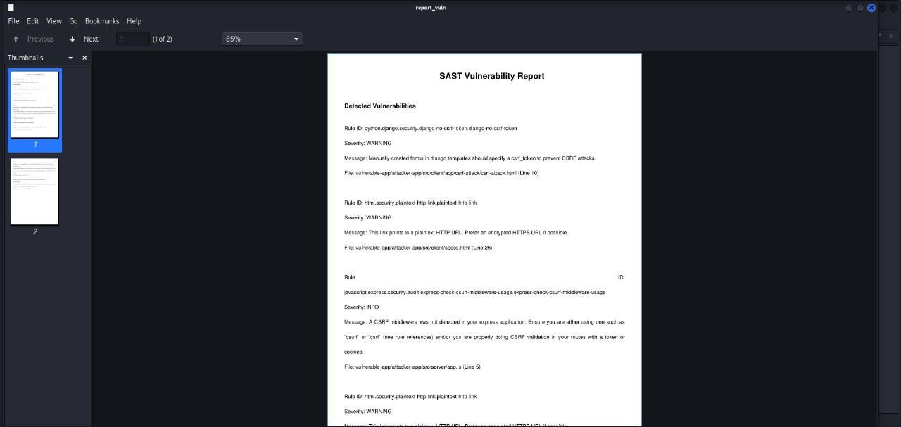

# Sast with Semgrep
---
This Python script will use Semgrep to scan for vulnerabilities in a specified directory. The script will automatically search for security flaws in the source code within the given directory using the available rule sets from Semgrep.

# How to Use
---
This program is straightforward to use. First, you need to install semgrep and fpdf to support the program. You can do this by running the following command:
```
pip install semgrep fpdf
```

Once installed, you can run the program with the command:
```
python3 main.py [YOUR SELECT DIRECTORY] [YOUR PDF NAME]
```

The report will be generate.

# Example Use
---
Before start, you can try with example vulnerability app[https://github.com/djadmin/vulnerable-app]. Download it and try this program!

After installing all the required dependencies, the next step is to run the program using the following command:
```
python3 main.py vulnerable-app report_dir
```
The program will analyze the specified directory for vulnerabilities. In the example below, I will scan the vulnerable-app folder and generate a report in PDF format. <br><br>


# Core Code
- run_semgrep(directory) Function
  code:
  ```
  result = subprocess.run(['semgrep', '--config', 'auto', directory, '--json'], check=True, capture_output=True, text=True)
  ```
  The purpose of this code for runs a vulnerability scan using Semgrep on a specified directory.
- create_report(scan_results, report_file) Function
  code:
  ```
  pdf = FPDF()
  pdf.add_page()
  pdf.set_font("Arial", 'B', 16)
  pdf.cell(200, 10, "SAST Vulnerability Report", ln=True, align='C')
  ```
  The purpose of this code for generates a PDF report with the vulnerabilities detected during the Semgrep scan.
- Command-line Argument Handling
  code:
  ```
  parser = argparse.ArgumentParser(description="Vulnerability Scanner with Semgrep (Report included)")
  parser.add_argument('directory', type=str, help='Target directory containing source codes')
  parser.add_argument('report_file', type=str, help='The output PDF report file name')
  ```
  The purpose of this code for allows the user to specify the target directory and the name of the PDF report file.

